# HeightMapTo3dTerrain

[](https://github.com/shanto462/HeightMapTo3dTerrain/actions/workflows/ci.yml)
[](https://github.com/shanto462/HeightMapTo3dTerrain/actions/workflows/codeql.yml)
[](https://scorecard.dev/viewer/?uri=github.com/shanto462/HeightMapTo3dTerrain)
[](LICENSE)
[](Cargo.toml)

`hmterrain` turns a grayscale heightmap into a 3D terrain mesh. It is a fast,
multi-threaded command-line tool and Rust library.

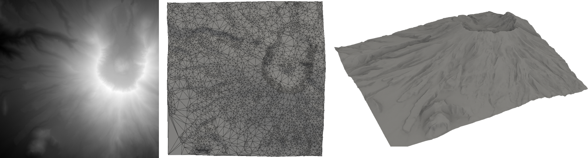

- **Adaptive meshes.** Flat areas get large triangles and detailed areas get
  small ones, with a guaranteed maximum error. A typical terrain needs 3% to 30%
  of the vertices of a full grid.
- **Exact full grids** when you want one vertex per pixel.
- **glTF, OBJ, STL and PLY** output, with normals and texture coordinates.
- **Solid bases** for 3D printing: closed, watertight meshes.
- **16-bit and float input** in PNG, TIFF, JPEG, BMP, TGA and PNM. Any aspect ratio.

## Examples

Real terrain from the [samples](samples/) folder, converted with the default
settings at true scale (heights in meters, real pixel size). The renders use
2× vertical exaggeration so the relief is easy to see. Times are for an Apple
M4 Pro.

| Input heightmap | Output mesh | Result |
| --- | --- | --- |
| 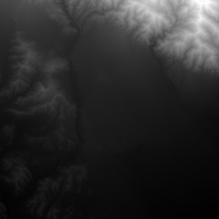 | 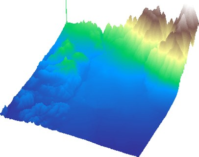 | **Pasadena (v1 sample, 8-bit)**<br>800×800 px<br>157,014 vertices (24.5% of pixels)<br>313,052 triangles<br>max error 0.79 units<br>0.15 s |
| 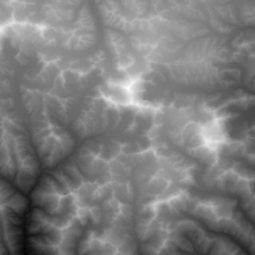 | 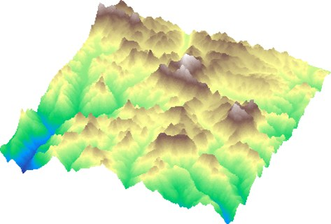 | **Mount Everest**<br>768×768 px<br>217,359 vertices (36.9% of pixels)<br>433,348 triangles<br>max error 6.57 m<br>0.20 s |
| 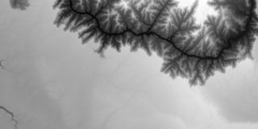 | 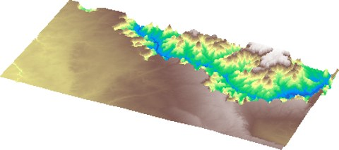 | **Grand Canyon**<br>1024×512 px<br>236,522 vertices (45.1% of pixels)<br>471,569 triangles<br>max error 1.83 m<br>0.21 s |
| 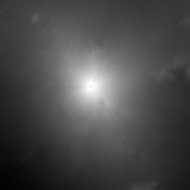 | 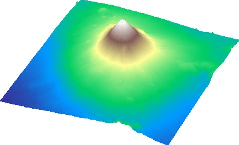 | **Mount Fuji**<br>768×768 px<br>52,463 vertices (8.9% of pixels)<br>104,407 triangles<br>max error 3.58 m<br>0.07 s |
| 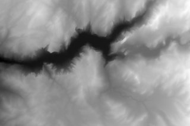 | 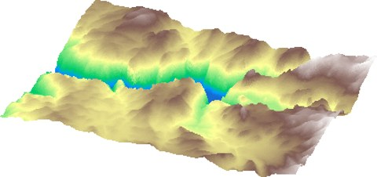 | **Yosemite Valley**<br>768×512 px<br>101,413 vertices (25.8% of pixels)<br>202,008 triangles<br>max error 1.98 m<br>0.10 s |
| 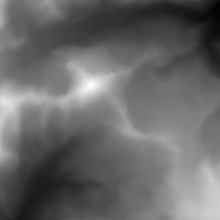 | 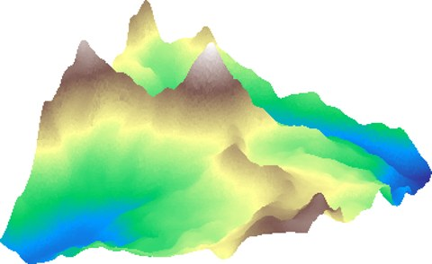 | **Matterhorn**<br>768×768 px<br>27,830 vertices (4.7% of pixels)<br>55,213 triangles<br>max error 2.65 m<br>0.05 s |
| 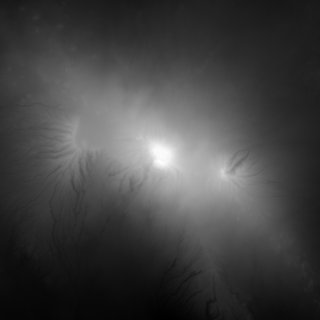 | 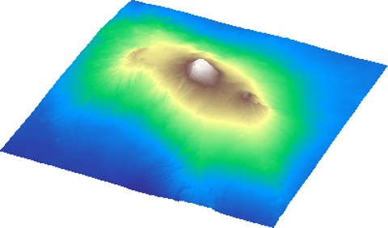 | **Kilimanjaro**<br>768×768 px<br>115,159 vertices (19.5% of pixels)<br>229,693 triangles<br>max error 5.05 m<br>0.12 s |
| 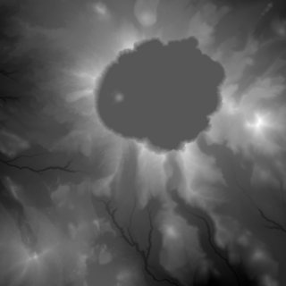 | 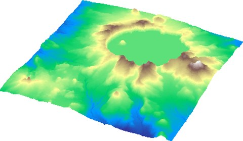 | **Crater Lake**<br>768×768 px<br>140,954 vertices (23.9% of pixels)<br>281,000 triangles<br>max error 1.26 m<br>0.14 s |

Each row is one command, for example:

```bash
hmterrain samples/heightmaps/everest_16bit.png everest.glb --min-height 2169 --max-height 8741 --pixel-size 67.497
```

The height ranges and pixel sizes of all samples are in
[`samples/heightmaps/metadata.json`](samples/heightmaps/metadata.json).
Rebuild this gallery with `samples/scripts/build_gallery.py`.

### Accuracy versus size

`--max-error` sets the trade-off. The same 512×512 heightmap of Mount St.
Helens at three error limits, in meters:

| `--max-error 3` | `--max-error 10` | `--max-error 30` |
| --- | --- | --- |
| 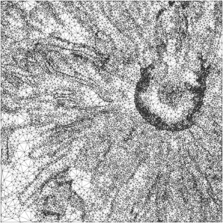 | 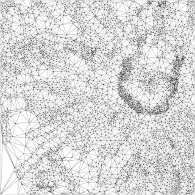 | 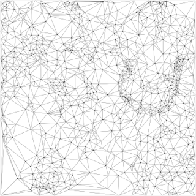 |
| 51,931 triangles (10.0% of pixels) | 11,603 triangles (2.2% of pixels) | 2,347 triangles (0.5% of pixels) |

### Solid for 3D printing

`--base 300` adds walls and a flat bottom 300 m below the lowest point. Open
[`assets/st_helens.stl`](assets/st_helens.stl) on GitHub to rotate a 20,000
triangle print-ready version in your browser.

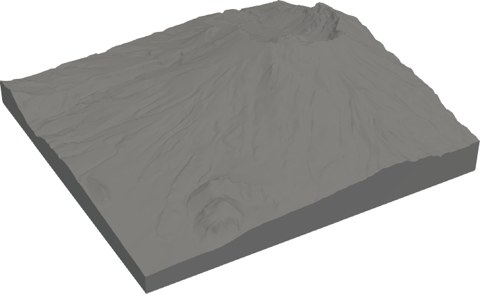

## Install

Download a binary for Linux, macOS or Windows from the
[latest release](https://github.com/shanto462/HeightMapTo3dTerrain/releases/latest).
Every archive has a SHA-256 checksum and a signed
[build provenance attestation](https://docs.github.com/en/actions/security-for-github-actions/using-artifact-attestations):

```bash
gh attestation verify hmterrain-2.0.0-aarch64-apple-darwin.tar.gz --repo shanto462/HeightMapTo3dTerrain
```

Or build from source with Rust 1.88 or newer:

```bash
cargo install --locked --git https://github.com/shanto462/HeightMapTo3dTerrain
```

## Usage

```bash
hmterrain heightmap.png terrain.glb --max-height 250
```

Try it with the bundled sample, a 16-bit heightmap of Mount St. Helens at true
scale (heights in meters, 13.2 m per pixel), and open the result in any glTF
viewer, for example [f3d](https://f3d.app):

```bash
hmterrain samples/heightmaps/st_helens_16bit.png st_helens.glb --min-height 942.66 --max-height 2537.14 --pixel-size 13.229
f3d st_helens.glb
```

The output format comes from the file extension. Some common tasks:

| Task | Command |
| --- | --- |
| Web viewer or game engine | `hmterrain dem.png terrain.glb --max-height 250` |
| 3D print, 0.2 mm per pixel, 3 mm base | `hmterrain dem.png print.stl --max-height 40 --pixel-size 0.2 --base 3` |
| Small mesh, error up to 1.5 units | `hmterrain dem.png small.obj --max-height 300 --max-error 1.5` |
| Fixed budget of 100k triangles | `hmterrain dem.png lod.glb --max-height 300 --max-triangles 100000` |
| One vertex per pixel | `hmterrain dem.png full.ply --max-height 300 --mode grid` |
| Black is high (depth map) | `hmterrain depth.png out.glb --invert` |

### Options

| Option | Default | Meaning |
| --- | --- | --- |
| `--min-height Z` | `0` | Height of the lowest pixel. |
| `--max-height Z` | `100` | Height of the highest pixel. |
| `--no-normalize` | off | Map black to `--min-height` and white to `--max-height`, instead of the darkest and brightest pixel. |
| `--invert` | off | Bright pixels are low, dark pixels are high. |
| `--pixel-size SIZE` | `1` | Horizontal distance between two pixels. |
| `--mode tin\|grid` | `tin` | Adaptive mesh, or one vertex per pixel. |
| `-e, --max-error Z` | see below | Largest vertical distance between any pixel and the mesh. |
| `--max-triangles N` | none | Stop refining before the mesh exceeds `N` triangles. |
| `--max-vertices N` | none | Stop refining before the mesh exceeds `N` vertices. |
| `--base THICKNESS` | none | Add walls and a flat bottom this far below the lowest point. |
| `--no-normals`, `--no-uvs` | off | Leave out vertex normals or texture coordinates. |
| `--no-center` | off | Put the top-left pixel at the origin instead of centering the mesh. |
| `-f, --format FMT` | from extension | `glb`, `obj`, `stl` or `ply`. |
| `-j, --threads N` | all cores | Worker threads. |
| `-q, --quiet` | off | Print nothing except errors. |

The default `--max-error` is 0.1% of the height range. For 8-bit images it is
half a gray level when that is larger, because finer detail would only
reproduce quantization noise.

### Coordinate system

Y points up. Image columns run along +X and rows along +Z, so the top edge of
the image faces −Z. Triangles wind counter-clockwise seen from outside. This
matches glTF, Blender (Y-up import), Three.js, Unity and Godot. Texture
coordinates map the heightmap image onto the terrain, so the same image (or an
aligned satellite photo) can be used as a texture.

### Formats

| Format | Normals | UVs | Notes |
| --- | --- | --- | --- |
| `.glb` | yes | yes | Binary glTF 2.0. Best for the web and game engines. Up to 4 GiB. |
| `.obj` | yes | yes | Text, widely supported, largest file. |
| `.stl` | per face | no | Binary STL for slicers. |
| `.ply` | yes | yes | Binary little-endian. |

With `--base`, walls and the bottom have their own vertices so their edges
stay sharp. The mesh is watertight once coincident vertices are merged, which
slicers do on import.

## How it works

1. **Load.** The image is decoded to luminance at its full precision (8-bit,
   16-bit or float) and mapped to the requested height range.
2. **Triangulate.**
   - `tin` uses greedy Delaunay insertion
     ([Garland and Heckbert, 1995](https://www.cs.cmu.edu/~garland/scape/)).
     It starts with two triangles. Then it keeps inserting the pixel with the
     largest error until every pixel is within `--max-error`. After each
     insertion, edge flips keep the triangulation Delaunay, which avoids thin
     slivers. Each step only rescans the triangles it changed. All geometric
     tests use exact integer arithmetic, so regular grids and collinear points
     never break the mesh.
   - `grid` splits every cell into two triangles along the diagonal whose
     corners have the closer heights, so diagonal ridges stay sharp.
3. **Build.** Area-weighted vertex normals, texture coordinates, and the
   optional solid base.
4. **Write.** Output is formatted in parallel and written to a temporary file
   that replaces the target only when complete.

On an Apple M4 Pro, a 2049×2049 16-bit terrain becomes a 0.1%-error mesh with
14% of the pixel count in under a second.

## Library

```toml
[dependencies]
heightmap-to-3d-terrain = { git = "https://github.com/shanto462/HeightMapTo3dTerrain" }
```

```rust
use heightmap_terrain::{export, HeightMapping, Heightmap, Mesh, MeshOptions, TinOptions};

let mapping = HeightMapping { min: 0.0, max: 250.0, ..HeightMapping::default() };
let map = Heightmap::load("dem.png", &mapping)?;
let options = TinOptions { max_error: 0.25, ..TinOptions::default() };
let (triangulation, stats) = heightmap_terrain::triangulate_tin(&map, &options)?;
let mesh = Mesh::build(&triangulation, &map, &MeshOptions::default())?;
export::save(&mesh, export::Format::Glb, "terrain.glb".as_ref())?;
```

## Upgrading from 1.x

Version 2 is a rewrite in Rust that replaces the .NET tool. The v1 command line
`hmterrain in.png out.obj -200 200` still works. Version 2 also fixes several
1.x bugs that affected every mesh: wrong height scaling, OBJ face indices off
by one, overlapping triangles, and locale-dependent number formatting. See the
[changelog](CHANGELOG.md).

## Contributing

Bug reports and pull requests are welcome. See [CONTRIBUTING.md](CONTRIBUTING.md)
for the development setup and checks. Please report security issues privately,
as described in [SECURITY.md](SECURITY.md).

## License

[MIT](LICENSE)

The sample heightmaps (except Pasadena) come from the
[Terrain Tiles](https://registry.opendata.aws/terrain-tiles/) open dataset on
AWS. See [samples/README.md](samples/README.md#data-sources) for the sources
and attribution.
